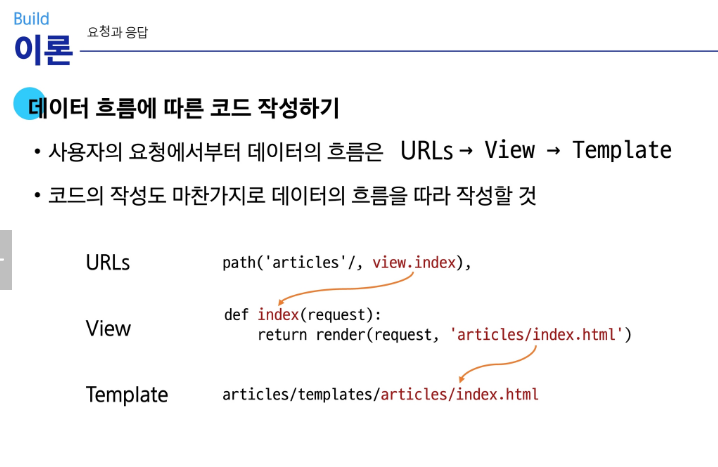

# 웹 페이지

클라이언트- 서버 구조    
클라이언트 - 서비스를 요청하는 주체(손님)  
서버 - 클라이언트의 요청에 응답하는 주체(주인)  

- 프론트엔드
  - 사용자 인터페이스를 구성하고 애플리케이션과 상호작용할 수 있도록 함
  - HTML, CSS, javascripts, 프론트엔드 프레임워크(vue.js) 등
- 백엔드
  - 클라이언트의 요청에 대한 처리와 데이터베이스 상호작용
  - Django, spring 등


# 장고 프레임워크
Python 기반의 대표적인 웹 프레임워크  

## 가상환경 설정  
관례적으로 이름을 venv로 사용  


가상환경 활성화: source venv/Scripts/activate 작성   
MAc/ Linux 일 경우: source venv/bin/activate    

가상환경 종료: deactivate  

## 의존성
다른 라이브러리가 실행되기 위해 필요한 패키지들    

라이브러리 버전관리  
pip freeze > requirements.txt  

설치버전 가져오기  
pip install -r requirements.txt  
requirements.txt 에 설치된 라이브러리 한 번에 설치  


# Django  
패키지 설치  
pip install Django    

프로젝트 생성    firstpjt: 파일명      
django-admin startproject firstpjt .     

서버실행 명령어  
python manage.py runserver  

# 디자인 패턴 Design Patten  
소프트웨어 설계에서 반복적으로 발생하는 문제에 대한      
검증되고 재사용 가능한 일반적인 해결책      

대표적인 디자인 패턴: MVC       
## MVC 디자인 패턴
- model
  - 데이터 및 비즈니스 로직을 처리
- View
  - 사용자에게 보이는 화면을 담당
- Controller
  - 사용자의 입력을 받아 Model과 View를 제어

## MTV 디자인 패턴 
django에서 애플리케이션을 구조화하는 디자인 패턴     
view -> Template      
controller -> view     

기존 MVC 패턴과 동일하나 명칭을 다르게 부른다.  

# 프로젝트와 앱 
한 프로젝트에서 기능별 목적에 따라 app으로 분리해 관리한다.     
ex) app1(로그인 기능): 로그인, 로그아웃, 회원 기능, app2(게시글): 게시글, 작성, 삭제      

카테고리별 분류    

앱 생성       
articles 라는 폴더와 내부에  여러 파일이 새로 생성됨       
python manage.py startapp articles      


# 프로젝트 구조
## firstpjt  
- __init__: 구조 잡기    
- settings.py: 프로젝트의 모든 설정   
- urls.py: URL에 따라 이에 해당하는 적절한 views를 연결
- asgi.py, wsgi.py: 배포시 사용

## 앱 구조 
- admin.py: 관리자용 페이지 설정  
- models.py: db와 관련된 model을 정의 MTV의 M
- views.py: HTTP 요청을 처리하고 해당 요청에 대한 응답을 반환  MTV의 V
- apps.py:


# 요청과 응답  
사용자가 요청 -> urls.py 응답    
http://127.0.0.1:8000/articles/ 로 요청이 왔을 때  
request 객체를 views 모듈의 index view 함수에 전달하며 호출

```py
# urls.py
# 해당 위치에 적기
from articles import views
urlpatterns = [
    path('admin/', admin.site.urls),
    path('articles/', views.index),
]
```

## View  
함수 생성 시 반드시 def index(request): 로 시작해야 한다.
```py
# views.py  
def index(request):
    return render(request, 'articles/index.html')
    # 템플릿 파일명과 위치 적기
```

## Template  
1. articles 앱 폴더 안에 templates 폴더 생성
2. templates 폴더 안에 ariticles 폴더 생성
3. articles 폴더 안에 템플릿 파일 생성. -> index.html
,

