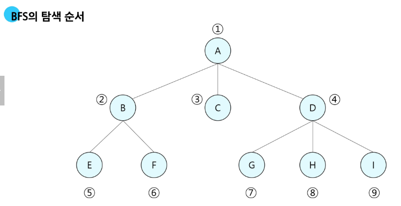

# 큐 Queue 
## 큐 FIFO
먼저 들어온 데이터가 먼저 나가는 선형 자료구조   
큐의 뒤에서는 삽입만 하고, 앞에서는 삭제만 이루어지는 구조   
선입선출 (FIFO, First In First out)   
### 큐의 구조
삭제 << 머리(front) <<<<< 꼬리(Rear) << 삽입   

### 큐의 기본 연산
- enqueue(item) : 큐의 뒤쪽(rear)에 원소를 삽입하는 연산
- dequeue() : 큐의 앞쪽(front)에 원소를 삭제하고 반환하는 연산
- create_queue() : 공백 상태의 큐 생성
- is_empty() : 큐가 공백상태인지 확인하는 연산
- is_full() : 큐가 포화상태인지를 확인하는 연산
- qpeek() : 큐의 앞쪽(front)에서 원소를 삭제 없이 반환하는 연산  

### 큐의 연산과정 
1. 공백 큐 생성: create_queue()
   - front = rear = -1
2. 원소 삽입 enqueue(A)
   - front = -1, rear = 0
3. 원소 삽입 enqueue(B)
   - front = -1, rear = 1
4. 원소 반환/삭제": dequeue()
   - front = 0, rear = 1
```py
n = 10
#공백 상태의 큐
q =[0]*n
# 변수 초기화
front = rear = -1

for i in range(1, 11):
    rear += 1
    q[rear] = i
print(q)
for i in range(10):
    front += 1
    #삭제 된걸로 치고 출력!
    print(q[front], end = ' ')
    # 스택처럼 실제로 삭제 되지는 않는다.
```
파이썬 리스트 메서드 사용가능 but 매우 느리니까 쓰지는 말자!
```py
n = 10
#공백 상태의 큐
q =[]
for i in range(1, 11):
    q.append(i)
print(q)
for i in range(10):
    e = q.pop(0)
    print(e, end = ' ')
print()
print(q)
```
## 선형 큐
구현 
- **배열**이나 **연결 리스트**로 구현 가능
- 배열로 구현시 큐의 크기는 배열의 크기와 같다.
- front: 가장 최근에 작세된 원소의 인덱스
-  rear: 마지막으로 젖아된 원소읭 인덱스  

상태표현
- 초기상태: front = rear = -1
- 공백 상태 front == rear
- 포화상태: rear == n-1(n: 배열의 크기, n-1 : 배열의 마지막 인덱스)

### 선형 큐 구현
1. 초기 공백 큐 생성: create_queue()
   - 크기 n인 1차원 배열 생성
   - front, rear = -1로 초기화
2. 삽입: enqueue(item)
   - 마지막 원소 뒤에 새로운 원소 삽입
   - rear 값을 하나 증가시켜 새로운 원소를 삽입할 자리 지정
   - rear 인덱스에 해당하는 위치에 값 저장 que[rear] = item
3. 삭제 dequeue()
   - 가장 앞에 있는 원소 삭제
   - front 값을 하나 증가시켜 큐에 남아있는 첫 번째 원소로 이동
   - 첫 번째 원소를 return함으로써 삭제와 동일한 기능을 함  
   - 핵심!! **front를 이동 후** 값을 꺼낸다.
   - 해당 위치에 값이 있는지 없는지 검사해야 한다.  
4. 공백상태 및 포화상태 검사: is_empty(), is_full()
   - 공백상태 : front == rear
   - 포화상태 : rear == n-1(n: 배열의 크기, n-1 : 배열의 마지막 인덱스)
5. 검색: qpeek()
   - 가장앞에 있는 원소를 검색하여 반환하는 연산
   - 현재 front의 한자리 뒤(front+1)에 있는 원소, 즉 큐의 첫 번째에 있는 원소를 반환

## 원형 큐  
선형 큐 이용시 front의 위치가 뒤쪽이고 rear도 맨 뒤에 있다면 잘못된 포화상태인 것  
앞 부분에 많은 공간이 있음에도 front의 위치가 뒤에 있으므로 인식을 못 한다.  
매 연산이 이루어질 때마다 옮긴다면 항상 원소 이동에 많은 시간이 소요되어 큐의 효율성이 급격히 하락한다.  
### 해결방법 
1차원 배열 이용 시, 논리적으로는 배열의 처음과 끝이 연결되어 원형을 이룬다고 하자  
### 원형 큐의 구조
- 초기 공백 상태: front = rear = 0  
- index의 순환
  - front 또는 rear의 위치가 배열의 마지막 인덱스인 n-1을 가리킵니다.
  - 그 다음에는 논리적 순환을 이루어 배열의 처음 인덱스인 0으로 이동해야 합니다.
- front 변수
  - 공백 상태와 포화 상태 구분을 쉽게 하기 위해 front가 있는 자리는 사용하지 않고 항상 빈자리로
### 선형 큐와 원형 큐 비교

        |삽입 위치|  삭제 위치
    |선형 큐| rear = rear + 1| front= |front + 1  |
    |원형 큐| rear = (rear + 1) mod(%) n| front= (front + 1) mod(%) n  |

### 원형 큐의 연산 구조
- 꼬리가 n이 넘어가면 인덱스 0이 비었을 경우 0의 자리가 꼬리가 된다. 
- n의 크기를 모두 가득 채울 경우 시작과 끝을 구분할 수 없다
- 따라서 한칸 비어있는 상태가 가득 찬 full 상태가 된다.  
- 시작상태 front = rear = 0

공백 상태 검사  
rear +1 의 위치가 큐의 크기로 나누었을때 나머지가 front의 위치와 같다면 가득 찬 것이다.
(rear + 1) % len(queue) == front  

rear 앞이 front 라면 이는 포화상태 이다. 한 칸 비워두기 때문  
and rear와 front가 같아지기 때문이다. 항상 front는 비워둘 것 
front ==rear 는 공백, (rear +1) mod n == front  는 포화상태
```py
N = 10
cq = [0]*N
front = rear = 0
def is_full():
   return (rear + 1) % N == front

# 원소 삽입
for i in range(1, 11):
    # 한 자리는 비워두기 때문에 원소가 9개만 들어간다.
    if not is_full():
        rear = (rear+1) % N
        cq[rear] = i
print(cq)
for i in range(9):
    front = (front+1) % N
    print(cq[front], end = ' ')
print()

print(cq)
print(front, rear)
# 비워두는 자리가 매번 바뀌기 때문에 주의할 것.
# 또한 원형이기 때문에 항상 자리를 한 칸 비워둬야 한다.
```
## 연결 큐  
연결 리스트를 이용해 구현한 큐  
현재 값과 다음 다음 리스트의 메모리 주소 두개를 담은 리스트가 이어진 구조  
A의 주소 :0x1000, B의 주소:0x1002, C의 주소: 0x1010
[A, 0x1002] > [B, 0x1010] > [C, NULL]
front = 0x1000(시작점인 A의 주소), rear = 0x1010(끝 점인 C의 주소)
**단순 연결 리스트(Linked List)**를 이용한 큐  
- 큐의 원소: 단순 연결 리스트의 노드
- 큐의 원소 순서: 노드의 연결 순서, 링크로 연결되어 있음
- front: 첫 번째 노드를 가리키는 링크
- rear: 마지막 노드를 가리키는 링크  

상태 표현
- 초기상태: front = rear = NULL
- 공백상태: front = rear = NULL
## 덱(deque)
- 컨테이너 자료형 중 하나로 양쪽 끝에서 빠르게 추가와 삭제를 할 수 있는 리스트류 컨테이너 
- 연결 리스트를 직접 만들지 않아도 된다.

### deque의 연산
append(x): 오른쪽에 x 추가  
popleft(): 왼쪽에서 요소를 제거하고 반환, 요소가 없으면 Index Error  
```py
from collections import deque

q = deque()
q.append(1) # enqueue
t = q.popleft() # dequeue
```

## 우선순위 큐 
우선순위를 가진 항목들을 저장하는 큐   
FIFO 순서가 아니라 우선순위가 높은 순서대로 먼저 나가게 됩니다.  
적용분야: 시뮬레이션 시스템, 네트워크 트래픽 제어, 운영체제의 태스크 스케줄링  
- 배열을 이용한 우선순위 큐
  - 원소의 재배치가 발생해 비효율적
- 효율적인 우선순위 큐
  - 트리구조인 힙(Heap) 사용

## 큐의 활용
## 버퍼 (Buffer)
데이터를 한 곳에서 다른 한 곳으로 전송하는 동안  
일시적으로 그 데이터를 보관하는 메모리의 영역  
버퍼링: 버퍼를 활용하는 방식, 버퍼를 채우는 동작
### 버퍼의 자료구조
순서대로 입력/출력/전달 되어야 하므로 FIFO 방식의 자료구조인 큐가 활용된다.  
- 키보드 버퍼   
  - 키보드 입력 > 키보드 입력 버퍼에 enter키 입력이 들어오면 > 프로그램 실행영역  
- 시뮬레이션 문제 등

## BFS
그래프를 탐색하는 방법
- 너비 우선 탐색(Freadth First Search, BFS)
- 깊이 우선 탐색(Depth First Search, DFS)
## BFS 너비 우선 탐색
탐색 시작 정점에 인접한 정점들을 모두 차례로 방문한 후에  
방문했던 정점을 시작점으로 하여 다시 인접한 정점들을 차례로 방문하는 방식  
**BFS의 탐색 순서**

첫 지점으로 부터 같은 거리인 지점을 탐색한다.  
BFS 기본구조
```py
def bfs(G, v): # 그래프 G, 탐색 시작점v 
    visited = [0]*(n+1)
    queue = []
    queue.append(v)
    while queue:
        t = queue.pop(0)
        if not visited[t]: # 중복으로 큐에 들어갔을 때 다시 나왔을 경우 다시 계산 방지
            visited[t] = True
            visit(t)
            for i in G[t]: # t 와 인접한 곳
                if not visited[t]:
                    queue.append(i) # 인접한 곳을 방문하지 않았다면 큐에 추가
```
중복으로 큐에 들어갈 수 있다.  
이를 해결하기 위해서는 방문 표시를 큐에 들어가는 순간(enqueue) 표시 한다.  
극복한 코드
```py
def bfs(G, v, n):
    visited = [0]*(n+1)
    queue = []
    queue.append(v)
    visited[v] = 1 # 큐에 넣고 바로 방문표시 한다.
    while queue:
        t = queue.pop(0)
        visit(t) # 할일
        for i in G[t]:
            if not visited[i]:
                queue.append(i)
                visited[i] = visited[t] + 1 # 시간 계산 및 방문표시를 함께 한다.
```
간선이 한 줄로 제공되는 경우 받아 오는법
```py
V, E =map(int, input().split())
arr = list(map(int, input().split()))
# arr = 1 2 1 3 2 4 2 5 4 6 5 6 6 7 3 7

adj_list = [[]for _ in range(V+1)]

for i in range(E):
    v1, v2 = arr[i*2], arr[i*2+1]
    adj_list[v1].append(v2) 
    adj_list[v2].append(v1) #방향이 없는 경우 쌍방향 연결

#함수 작성
def dfs(s, V): # 시작정점 s, 마지막 정점 V
    # 방문 생성
    visited = [0]*(v+1)
    # 큐 생성
    q = []
    # 시작점 인큐
    q.append(s)
    # 시작점 방문 표시
    visited[s] = 1
    # whlie 반복, 큐에 남은 정점이 있으면
    while q:
        # deque 후 값 저장
        t = q.pop(0)
        # deque 정점 방문
        # t에 인접하고 enque 되지 않은 정점이 있으면
        for w in adj_list[t]:
            if visited[w] == 0:
        # 정점을 enque 한다.
        q.append(w)
        # enque한 정점을 방문했다고 한다.
        visited[w] = visited[t] + 1
```
