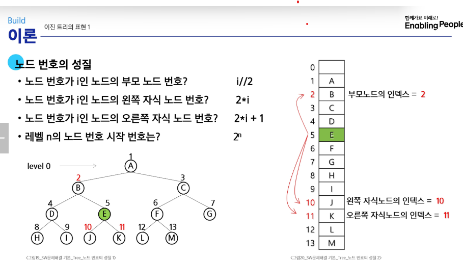

# Tree
## 트리
1. 비선형 자료구조
2. 원소들 간에 1:N 관계를 가지는 자료구조
3. 원소들 간에 계층관계를 가지는 계층형 자료구조
4. 상위 원소에서 하위 원소로 내려가면서 확장되는 트리(나무)모양의 구조  
트리를 잘라내도 각각의 트리이며 이를 부트리(subtree)라 한다.   
- 한개 이상의 노드로 이루어져 있다.
- 최상위 노드를 루트(root)라 한다.
- 마지막 노드를 잎(leaf) 노드 라 한다.

- 노드(node) - 트리의 원소
- 간선(edge) - 노드를 연결하는 선, 부모노드와 자식노드를 연결  


- 루트 노드(root node) - 트리의 시작 노드(꼭대기)
- 형제 노드 - 같은 부모 노드의 자식 노드들
- 조상 노드 - 간선을 따라 루트 노드까지 이르는 경로에 있는 모든 노드들
- 서브 트리(subtree) - 부모노드와 연결된 간선을 끊었을 때 생성되는 트리
- 자손 노드 - 서브 트리에 있는 하위 레벨의 노드들  


- 노드의 차수 - 노드에 연결된 자식 노드의 수
- 트리의 차수 - 트리에 있는 노드의 차수 중에서 가장 큰 값
- 단만 노드(리프노드) - 차수가 0인 노드. 자식 노드가 없는 노드    


- 노드의 높이 - 루트에서 노드에 이르는 간선의 수. 노드의 레벨
- 트리의 높이 - 트리에 있는 노드의 높이 중에서 가장 큰 값. 최대 레벨

## 이진 트리 
- 모든 노드들이 2개 이내의 자식을 갖는다.
- 각 노드가 자식 노드를 최대 2개까지만 가질 수 있음(왼쪽, 오른쪽)
- **포화 이진 트리**
  - 모든 레벨에 노드가 포화상태로 차 있는 이진 트리
  -  높이가 h인 노드의 개수: 2^h - 1 = 노드의 개수  
- **완전 이진 트리**
  - 높이가 h이고 노드 수가 n개일 때 (단 2^h <= n <= 2^(h+1) -1)
  - 포화 이진 트리의 노드 번호 1번부터 n번까지 빈자리가 없는 이진트리
  - 포화 이진 트리에서 마지막 부분이(k개) 비어 있는 형태이다.  
- **편향 이진 트리**
  - 높이가 h에 대한 최소 개수의 노드를 가지면서 한쪽 방향의 자식 노드만들 가진 이진 트리
  - 한쪽 방향만 존재하는 트리(선형 자료와 동일)
  - 1-2-3-4 가 한쪽 방향으로 치우친 형태

## 이진 트리 표현 1 
배열을 이용한 이진 트리의 표현  
레벨 n에 있는 노드에 대하여 왼쪽부터 오른쪽으로 2^n 부터 2^(n+1)-1 까지 번호를 부여 
- 포화 이진 트리, 완전 이진 트리에 적합
- 루트가 1번 시작
### 노드 번호의 성질
- 노드 번호가 i인 노드의 부모 노드 번호: i//2
- 노드 번호가 i인 노드의 왼쪽 자식 노드 번호: 2*i
- 노드 번호가 i인 노드의 오른쪽 자식 노드번호: 2*i + 1
- 레벨 n의 노드 번호 시작 번호: 2^n  
  

### 배열을 이용한 이진 트리의 표현
- 노드 번호를 배열의 인덱스로 사용
- 높이가 h인 이진 트리를 위한 배열의 크기는?: 2^(h+1)-1
- 높이가 0부터 3 까지라면 2^4 - 1: 0~15 까지의 배열 생성  

편향 트리인 경우 [None, A, B, None, C, None, ... ,D, None..., E]

## 이진 트리 표현 2  
for i : 1 -> N  
    read p, c  
    # 첫 번째 자식이 비어있으면 첫번째 자식으로  
    if c1[p] == 0  
        c1[p] = c  
    # 첫번째 자식이 차 있으니 두번째 자식으로 넣기  
    else  
        c2[p] = c   


q부모 번호를 인덱스로 자식 번호 저장하기
```py
V = E + 1 #간선수 + 1 => 마지막 정점 번호
# 부모번호를 인덱스로 자식번호를 저장하는 배열
c1 = [0]*(V+1)
c2 = [0]*(V+1)

for i in range(E):
    p, c = arr[i*2], arr[i*2+1]
    if c1[p] == 0: # 아직 자식 1이 없으면
        c1[p] = c
    else:
        c2[p] = c
print(c1)
print(c2)
```
자식번호를 인덱스로 부모 번호 저장하기
```py
for i in range(E):
    p, c = arr[i*2], arr[i*2+1]
    par[c] = p
# p 부모번호, c는 자식 번호
for i in range(1, V+1):
    if par[i] == 0: # 부모가 없으면 루트 이다.
        root = i  
        break
```
루트 찾기, 조상 찾기  
```py
c= 5
while( a[c] != 0):
    c = a[c] 
    anc.append(c) # 조상목록
root = c   
```
배열을 이용한 이진 트리 표현 - 트리의 중간에 새로운 노드 삽입하거나 삭제 시, 배열의 크기 변경이 어렵다.  
연결리스트 - 배열을 이용한 이진 트리의 표현의크기  
## 순회
트리의 각 노드를 중복되지 않게 전부 방문(visit)하는 것  
- 전위 순회(Preorder Traversal): VLR
- 중위 순회(Inorder Traversal): LVR
- 후위 순회(Postorder Traversal): LRV    

서브트리에서 순회를 시작하면 해당 서브트리 안에서만 순회를 하고 끝난다.
### 전위 순회 
1. 현재 노드 n을 방문한다: V
2. 현재 노드 n의 왼쪽 서브트리로 이동한다
3. 현재 노드 n의 오른쪽 서브트리로 이동한다.
```py
preorder_traverse(T):
    if T:
        visit(T)
        preorder_traverse(T.left)
        preorder_traverse(T.right)
```

### 중위 순회
1. 현재 노드 n의 왼쪽 서브트리로 이동한다
2. 현재 노드 n을 방문한다
3. 현재 노드 n의 오른쪽 서브트리로 이동한다.
```py
inorder(T):
    if T:
        inorder(T.left)
        visited(T)
        inorder(T.right)
```
### 후위 순회
1. 현재 노드 n의 왼쪽 서브트리로 이동한다
2. 현재 노드 n의 오른쪽 서브트리로 이동한다.
3. 현재 노드 n을 방문한다
```py
postorder(T):
    if T:
        postorder(T.left)
        postorder(T.right)
        visited(T)
```
## 수식 트리
- 수식을 표현하는 이진 트리
- 수식 이진 트리(Expression Binary Tree)라고 부르기도함
- 연산자는 루트 노드이거나 가지 노드
- 피연산자는 모두 잎 노드(자식이 없음) 