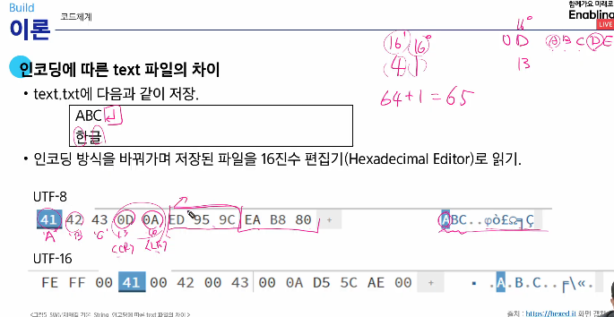

# 문자열
## 코드 체계

### 아스키(ASCII)
ASCII(아스키 문자) : 7bit를 이용하여 128문자를 표현하여 출력 불가능한 제어문 33개와 공백을 비롯한 출력 가능한 문자들로 이루어짐.  
확장 아스키:1Byte 내의 8bit를 모두사용함으로써 추가적인 문자를 표현할 수 있음.   
 
### 유니코드  
각 국가들은 자국의 문자를 표현하기 위해 코드체계를 만들어 사용하게 됨.  
각 국가별로 다른 코드체계를 사용하면서 정보를 주고 받을 떄 문제가 발생 함.  
다국어 처리를 위해 표준인 **유니코드**를 만듦  
이모지(Emoji)도 유니코드 문자입니다.  
글자의 코드를 통해 키보드에 없는 것을 출력할 수 있다.(16진수)
ex) print('\uB364') 를 출력하면 '덤'이 나온다.  

### 바이트 단위 저장  
Endian: 여러 바이트로 이루어진 데이터를 저장하는 방식
Big-endian은 상위 바이트(MSB)를 가장 낮은 주소에 저장
Little-endian은 하위바이트(LSB)를 가장 낮은 주소에 저장
순서가 뒤바뀔 수 있음. 따라서 인코딩이 필요한 것.  

### 유니코드 인코딩
UTF-8(in -web)
- Min: 8bit, Max: 32bit 
- 필요한 크기에 따라 저장한다. 10bit가 필요하다면 16비트 사용, 20비트 필요하다면 24bit 사용  
- 데이터를 쪼개서 쓰는것이 더 비효율적(추가 처리 시간) 하지만 전송 시에는 용량이 적기 때문에 좋다.  

UTF-16(in windows, java)
- Min: 16bit, Max: 32bit   

UTF-32(in unix)
- Min: 32bit, Max: 32bit 
- 변환을 안하므로 빠르다.  

Pycharm 아래를 보면 UTF-8 로 인코딩 되어있다. 눌러서 인코딩 방식을 변경할 수 있다.  

...? 뭔지 하나도 모르겠는데 알아야 할 것 같음.  
CRLF: CR을 쓰거나 LF를 쓰는 것이다.   
윈도우는 CR(13)과 LF(10) 두 글자를 사용합니다.  
Unix와 macOS는 LF(10) 한 글자를 사용합니다.  

인코딩에 따른 text 파일의 차이  
인코딩 방식을 바꿔가며 저장된 파일을 16진수 편집기로 읽기  
Byte 단위로 끊어서 각 문자를 읽는다.

UTF-8은 <CR><LF>  
UTF-16은 <LF>  
0D는 CR(13), 0A는 LF(10)  

## 문자열(string)  
문자들이 순서대로 나열된 데이터  
Length-COntrolled 문자열: 문자열의 길이 정보를 함께 저장한다.  
Delimited 문자열: 문자열의 끝을 나타내는 특정한 구분자가 있어서 구분자가 나올 때까지 문자열로 인식합니다. C언어는 널 문자(null, \0)을 사용합니다.  

### 파이썬 str 클래스 구조  
길이 외에 다양한 정보 저장  
PyObject_HEAD: 모든 python 객체가 상속하는 공통 구조  
lenght: 문자열의 길이  
hash: 문자열의 해시값으로, 딕셔너리 키로 쓸 때 사용   
interned: 같은 문자열을 관리하는 플래그  
kind: 문자열 인코딩의 크기  
data: 문자열이 저장된 실제 메모리 주소를 가리키는 포인터  

### C언어의 문자열  
항상 마지막에 끝을 표시는 널 문자 필요  
char ary[] = 'abc';  // char ary[] = {'a', 'b', 'c', '\0'};

### java에서의 문자열  
string 클래스  
string str = "abc"; // 또는 String str = new String("abc");  

### python3에서의 문자열  
텍스트 데이터의 취급 방법이 통일되어 있다.  
연산 가능 +, *  

데이터의 순서가 구분되는 시퀀스 자료형으로 분류  
인덱스는 사용가능하나, 요소값을 변경할 수 없음  
text = list(input())을 하면 각 글자가 리스트의 원소로 저장됩니다. 이를 통해 원소별 다른 글자로 수정할 수 있다.  
str도 인덱스가 가능하므로 값 변경이 아닌 단순 찾기는 굳이 list로 받지 않아도 가능하다.  

입력값에서의 특정 패턴 감지
```python
# 4중 반복문 이용 
N = int(input())
text = [input() for _ in range(N)]
pat = ['AB', 'CD']
ans = 'NO'
# 완전 탐색
for i in range(N-1):
    for j in range(N-1):
        #값 검사
        cnt =0
        # i, j 에서  2x2 행렬 탐색 모든 값 일치시  cnt = 4
        # 순회로 해당 영역 탐색
        for p in range(2):
            for q in range(2):
                if text[i+p][i+q] == pat[p][q]:
                    cnt += 1

        if cnt == 4:
            ans = 'Yes'
print(ans)


# 델타 이용 해당 방향에 일치하는 값이 있는지
N = int(input())
text = [input() for _ in range(N)]

dy = [0, 0, 1, 1]
dx = [0, 1, 0, 1]
pat = ['A', 'B', 'C', 'D']
ans = 'NO'
#완전탐색
for i in range(N-1):
    for j in range(N-1):
        # 델타로 해당 방향 진행 후 탐색
        cnt = 0
        for ny, nx in zip(dy, dx):
            if text[i+ny][j+nx] == pat[cnt]:
                cnt += 1
        if cnt == 4:
            ans = 'Yes'
print(ans)
```

## 연산
문자열 뒤집기 : s = s[::-1]

### 회문
기러기, 토마토 등 거꾸로 읽어도 똑같은 낱말  

for i : 0 -> len(txt)/2 - 1  
        if txt[i] != txt[len(txt) - 1 - i]  
            return False  
### 문자열 비교
== : 값을 비교한다.
is : 객체의 주소를 비교합니다.

C언어: strcmp() 함수를 사용해 문자열의 내용을 비교한다.  
Java: == 연산자는 객체의 주소를 비교합니다. (python의 is)  
equals()  메소드는 객체의 내용을 비교합니다. (python의 == )    

문자열에 대한 비교(<) 연산은 유니코드 값에 대한 비교이다.

진수 변환 int('A0', 16) # 문자열 A0을 16진법으로 해석하여 10진법으로 변환

## 패턴 매칭
## 고지식한 패턴 검색

단순한 방법: ex) 문자열을 처음부터 끝까지 차례대로 순회하면서 패턴 내의 문자들을 일일이 비교한다.  
20자리에서 5자리 찾기 2015자리를 탐색하며 첫번째 인덱스에서 5개 값 비교  
시간 복잡도 : O(MN)  (Θ: 일반적으로 걸리는 시간)Θ(n)
```python
def brute_force(p, t):
    i = 0
    j = 0
    M = len(p)
    N = len(t)
    while j < M and i < N:
        if t[i] != p[j]:
            i = i -j
            j = -1
        


```
## KMP 알고리즘  
패턴의 각 위치에서 매칭에 실패했을 때 돌아갈 위치를 미리 계산  

시간 복잡도
- 패턴의 길이가 M일떄 전처리에 걸리는 시간은 O(M) 입니다.
- 텍스트의 길이가 N일때 검색은 최악의 경우 O(N) 입니다.
- 결과적으로 O(M+N)이 됩니다.  
- 일반적을 Θ(n)  

패턴이 반복될 때 사용?  
LPS 배열: 접두사이자 접미사인 문자열의 최대 길이
```python
def kmp(t, p):
    N = len(t)
```

## 보이어 무어 알고리즘  
- 상용 소프트웨어에서 채택하고 있는 알고리즘
- 실제 검색에서 매우 빠른 성능
- 패턴 오른쪽 끝에 있는 문자가 불일치하고 이 문자가 패턴 내에 존재하지 않는다면 패턴의 길이만큼 이동한다. (오른쪽 끝과 비교한 문자가 패턴내에 존재하지 않는다면 해당 문자가 비교대상에 있다면 무조건 불일치 하기 때문)   
- 텍스트 문자를 다 보지 않습니다.   

시간 복잡도  
- 최악의 경우 O(mn) 일반적으로 Θ(n)보다 덜 든다.
- 최선의 경우에도 Ω(n) 이다.
### 불일치 문자 휴리스틱  
- 오른쪽 끝에 있는 문자가 불일치 하고 이 문자가 패턴 내에 존재할 경우
- 불일치 문자 오른쪽에서 일치한 부분을 고려해 점프합니다.  


## 문자열 암호화  

### 시저 암호  
시저 암호는 평문에서 사용되고 있는 알파벳을 일정한 문자 수 만큼 **평행이동** 시킴으로서 암호화  


### 문자 변환표를 이용한 암호화  (단일 치환 암호화)
알파벳 하나를 다른 고정된 알파벳으로 바꾸는 방법입니다.  
- 모든 키의 조합이 필요
- 키의 총 수: 26! --> 1초에 10억개의 키를 적용해도 120억년 이상 걸린다.  
- 빈도 분석을 이용한다.  
  - 가장 많이 쓰이는 글자 E, T, A 등이다.
  - 암호문에 자주 나오는 문자를 추정해 대응시켜 해독이 가능하다.

### 문자열 압축  
Run-length encoding 알고리즘
- 같은 값이 몇번 반복되는가
- 이미지 파일 포맷 중 BMP 파일의 압축 방법 중 하나로 사용한다.
- A B B B B B B B B A --> A 1 B 8 A 1  
  
**허프만 코딩 알고리즘**
- 더 효율적이고 일반적인 압축 방법
- 자주 나오는 문자는 짧은 코드, 드물게 나오는 문자는 긴 이진 코드를 부여해 평균 비트 수를 최소화 하는 알고리즘  


